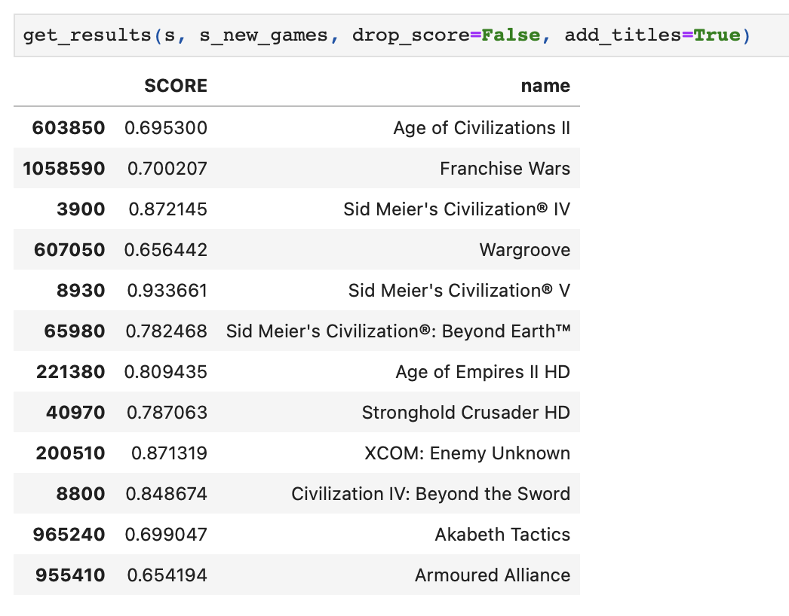

# Video Game Recommendation System

A sophisticated recommendation system built to suggest video games based on multiple factors, utilizing the power of various similarity metrics.

## Introduction

The video game industry has a plethora of games, making it overwhelming for gamers to choose the next best game to play. This project aims to simplify that choice by providing game recommendations based on multiple facets of games, including developer, genre, description, and more.

## Features

- **Multi-Factor Similarity**: Calculates similarity scores using various attributes of games like developers, tags, genres, and descriptions.
- **NLP Proceszing** Using SpaCy to transform game descriptions in vectors.
- **Weighted Scoring**: Empirical weighting system to rank recommendations based on importance.
- **Top-N Recommendations**: Returns the top recommended games for a target game.
- **Data Cleaning and Transformation**: Pre-processes raw data to make it suitable for score calculations.

## Technologies Used

- Python
- pandas
- spaCy
- scikit-learn

